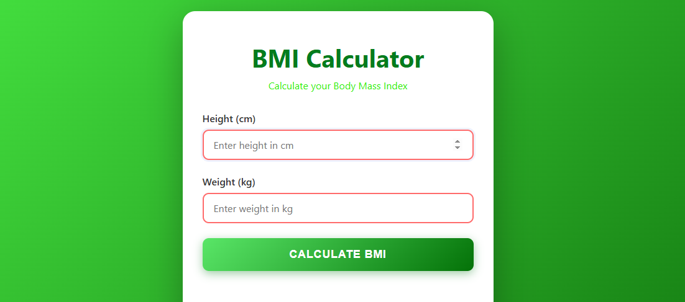
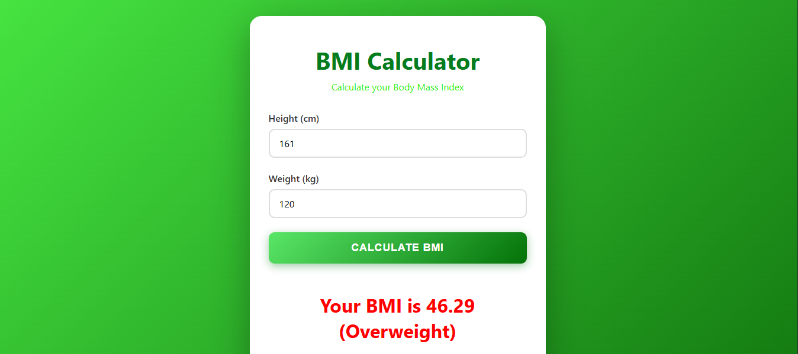
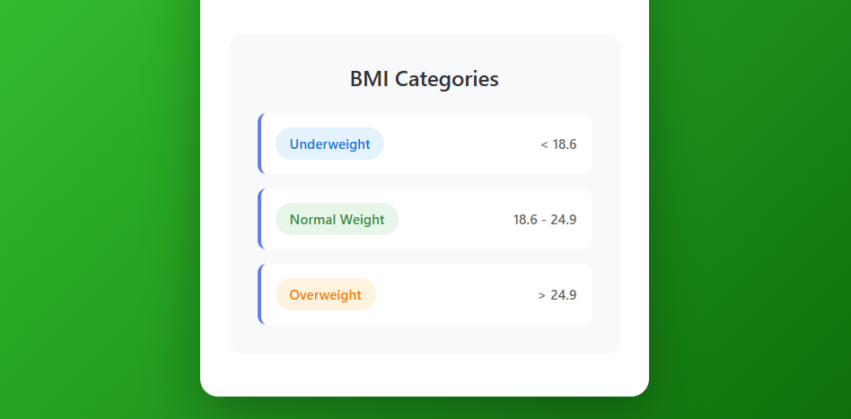

# 💪 BMI Calculator

A sleek, responsive, and interactive Body Mass Index (BMI) calculator built with modern web technologies. This project demonstrates clean code practices, responsive design, and professional UI/UX.

---

## ✨ Features

- **🎯 Accurate BMI Calculation** - Calculates BMI based on height and weight inputs
- **📱 Fully Responsive Design** - Works seamlessly on desktop, tablet, and mobile devices
- **🎨 Modern UI/UX** - Beautiful gradient background with smooth animations and transitions
- **⚡ Real-time Validation** - Input validation with helpful error messages
- **🎯 BMI Categories** - Color-coded feedback (Underweight, Normal, Overweight)
- **♿ Accessible** - Semantic HTML and proper form handling for accessibility
- **🚀 Fast & Lightweight** - Pure vanilla JavaScript, no dependencies

---

## 📸 Screenshots

### Dashboard



### Results Display



### BMI Categories Guide



---

## 🛠️ Tech Stack

| Technology               | Purpose                                                |
| ------------------------ | ------------------------------------------------------ |
| **HTML5**                | Semantic structure and form handling                   |
| **CSS3**                 | Modern styling with gradients, flexbox, and animations |
| **JavaScript (Vanilla)** | Form logic, BMI calculation, and DOM manipulation      |

---

## 📊 BMI Categories

The calculator uses the following BMI categories:

| Category         | BMI Range   |
| ---------------- | ----------- |
| 🔵 Underweight   | < 18.6      |
| 🟢 Normal Weight | 18.6 - 24.9 |
| 🟠 Overweight    | > 24.9      |

---

## 🚀 Getting Started

### Prerequisites

- Any modern web browser (Chrome, Firefox, Safari, Edge)
- No installation or dependencies required!

### Installation

1. **Clone the repository**

   ```bash
   git clone https://github.com/Ayon-CSE/BMI-Calculator.git
   cd BMI-Calculator
   ```

2. **Open in browser**
   ```bash
   # Simply open the index.html file in your web browser
   # Or use Live Server in VS Code for better development experience
   ```

---

## 💻 How to Use

1. Enter your **height** in centimeters (cm)
2. Enter your **weight** in kilograms (kg)
3. Click **Calculate BMI** button
4. View your BMI result with category and health status

### Example

- Height: 175 cm
- Weight: 70 kg
- Result: **BMI = 22.86 (Normal weight)** ✅

---

## 🎨 Design Highlights

### Responsive Breakpoints

- **Extra Small (<360px)** - Mobile phones
- **Small (360-480px)** - Tablets in portrait
- **Medium (481-768px)** - Tablets in landscape
- **Large (768px+)** - Desktop and above

### Visual Features

- Gradient background with modern colors
- Smooth animations on page load
- Hover effects on interactive elements
- Color-coded category system
- Professional typography and spacing

---

## 📝 Code Quality

### JavaScript Best Practices

```javascript
// Input validation before calculation
if (h === "" || h < 0 || isNaN(h)) {
  r.textContent = "Please enter a valid height";
  r.style.color = "red";
  return;
}

// Accurate BMI formula
const bmi = (w / ((h * h) / 10000)).toFixed(2);

// Semantic HTML with proper form attributes
<input
  type="number"
  id="height"
  placeholder="Enter height in cm"
  min="0"
  step="0.1"
  required
/>;
```

### CSS Organization

- Semantic selectors
- Flexbox for layout
- CSS Grid for guide items
- Mobile-first responsive approach
- Smooth transitions and animations

---

## 🎯 Features Implemented

- ✅ Semantic HTML5 structure
- ✅ Input type validation (number)
- ✅ Error handling with user-friendly messages
- ✅ Real-time result display
- ✅ Category-based color coding
- ✅ Fully responsive design
- ✅ Modern CSS animations
- ✅ Form reset functionality
- ✅ Accessibility (aria attributes, proper labels)

---

## 📱 Browser Compatibility

| Browser         | Support         |
| --------------- | --------------- |
| Chrome          | ✅ Full Support |
| Firefox         | ✅ Full Support |
| Safari          | ✅ Full Support |
| Edge            | ✅ Full Support |
| Mobile Browsers | ✅ Full Support |

---

## 🔮 Future Enhancements

- [ ] Dark mode toggle
- [ ] BMI history tracking (localStorage)
- [ ] Multiple unit support (lbs/inches, etc.)
- [ ] Personalized health recommendations
- [ ] BMI chart visualization
- [ ] Share results feature

---

## 📂 Project Structure

```
BMICalculator/
├── index.html          # HTML structure
├── style.css          # Styling and responsive design
├── script.js          # JavaScript functionality
└── README.md          # Project documentation
```

---

## 💡 Learning Outcomes

This project demonstrates:

- **DOM Manipulation** - Using querySelector to select and manipulate elements
- **Form Handling** - Event listeners and form submission
- **Input Validation** - Error checking and user feedback
- **Responsive Design** - Mobile-first approach with media queries
- **Modern CSS** - Gradients, flexbox, animations, and transitions
- **Clean Code** - Well-organized, commented, and maintainable code

---

## 🤝 Contributing

Contributions are welcome! Feel free to:

1. Fork the repository
2. Create a feature branch
3. Commit your changes
4. Push to the branch
5. Open a Pull Request

---

## 📄 License

This project is open source and available under the MIT License.

---

## 👨‍💻 Author

**Ayon-CSE**

- GitHub: [@Ayon-CSE](https://github.com/Ayon-CSE)
- Email: dasguptaayon55@gmail.com

---

## 🙌 Acknowledgments

- Inspired by real-world BMI calculation standards
- Built following best practices in web development
- Designed with user experience and accessibility in mind

---

## 📞 Contact & Support

If you have any questions or suggestions, feel free to:

- Open an issue on GitHub
- Contact via email
- Connect on LinkedIn

---

**Made with ❤️ by Ayon-CSE**

⭐ If you find this project helpful, please consider giving it a star!
